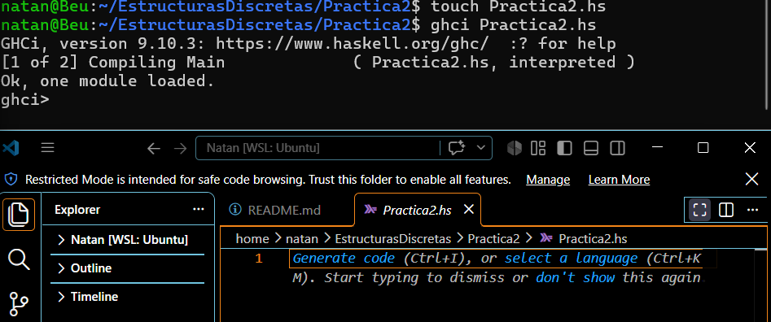

## Objetivo
Aprender la sintaxis básica del lenguaje Haskell, utilizando el entorno interactivo GHCI para definir y evaluar funciones elementales, condicionales y el manejo de tuplas.

## Tiempo requerido en realizar la práctica completa

## Comentarios y problemas a los que te enfrentaste en la práctica con su respectiva solución

